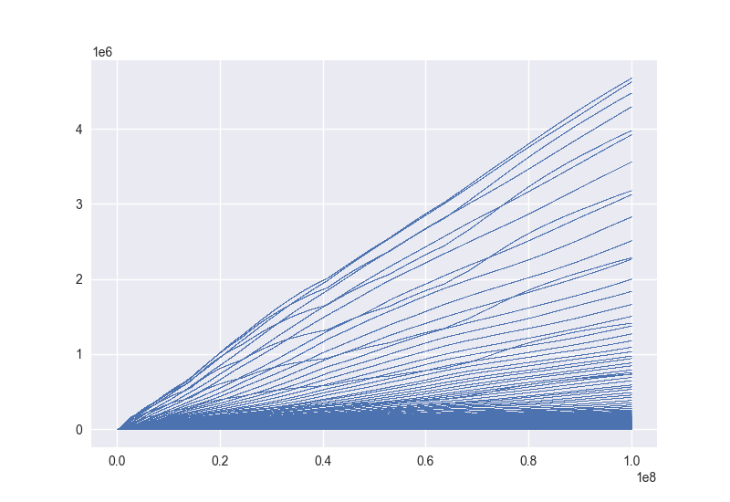

These scripts generate the sequence [A342585](https://oeis.org/A342585), inspired by [the Numberphile video](https://www.youtube.com/watch?v=rBU9E-ZOZAI&ab_channel=Numberphile) on it.

## How to run

The project uses [poetry](https://python-poetry.org/). See basic usage there.

To set up the environment, this should suffice:
```bash
poetry install
```

Then, to generate, say, a million terms from the sequence, run

```bash
poetry run python print_sequence.py 1000000
```

If you omit the last argument, the script will generate terms until forced to terminate.

To generate a plot, use

```bash
poetry run python plot_sequence.py 1000000
```

Here, the number of terms is mandatory but you can add an additional argument to determine the output file name
and, literally by extension, the output file type:

```bash
/usr/bin/time -fpeak_used_memory:%M poetry run python plot_sequence.py `echo 10^8 | bc` plots/myplot.pdf
```

Generating 10^8 terms took 9:42 minutes on my 2018 MacBook Pro with a 2.3 GHz Intel Core i5 and just 3:41 minutes
on my desktop 4GHz Intel Core i7-6700K:

